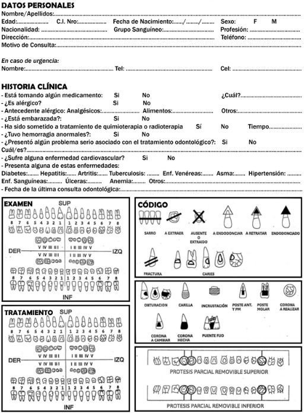
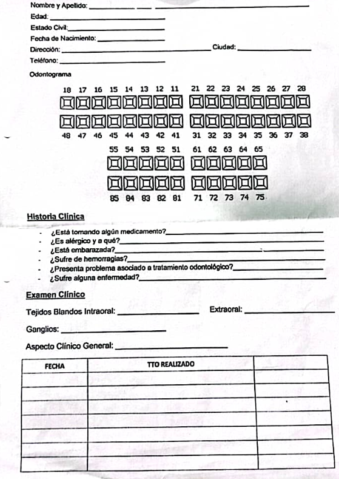

# Transfondo

En Paraguay, la mayoría de los consultorios odontológicos aún no cuentan con sistemas electrónicos para gestionar las fichas clínicas de sus pacientes.
Esta carencia afecta tanto la calidad como la precisión en el acceso a la información clínica, generando procesos fragmentados y poco eficientes. Además, los sistemas existentes carecen de estándares internacionales que permitan la interoperabilidad, entendida como la capacidad de que dos o más sistemas intercambien y utilicen la información compartida de manera efectiva.

En este contexto, el proyecto busca desarrollar un sistema de ficha clínica electrónica odontológica interoperable, basado en el estándar [HL7-FHIR](https://hl7.org/fhir/) (Fast Healthcare Interoperability Resources), para mejorar la gestión y el intercambio de información clínica en el ámbito odontológico. 

La falta de interoperabilidad representa un desafío y oportunidad en términos de la actualización tecnológica y la integración de los consultorios odontológicos en una infraestructura sanitaria digital más amplia y eficiente. 
## Fichas Odontologicas utilizadas en Paraguay brindada por colaboradores

## Atencedentes
En el proceso de búsqueda de antecedentes sobre fichas clínicas electrónicas odontológicas interoperables, se identificó un proyecto de la [Asociación Americana Dental (ADA)](https://www.ada.org/), orientado a abordar la necesidad histórica de mejorar la comunicación entre los proveedores de atención primaria y los proveedores de salud dental. Tradicionalmente, esta comunicación se realizaba mediante papel o adjuntos por correo electrónico, implicando que los procesos de derivación de pacientes fueran fragmentados e ineficientes. Este problema fue identificado como una de las principales barreras a resolver. Para ello, se utilizaron los estándares interoperables HL7 CDA y FHIR como resultado, surgió la iniciativa [Dental Data Exchange](https://build.fhir.org/ig/HL7/dental-data-exchange/index.html), cuyo propósito es optimizar el intercambio de información entre dentistas y otros profesionales de la salud.

OdontoFHIR puede facilitar la continuidad de atención de un mismo paciente entre distintos centros, a pesar de que:

- Se utilicen sistemas diferentes (con y sin FHIR),
- El paciente se atienda en distintos momentos y lugares,
- Existe una red nacional externa, como HL7 Chile, que pueda integrarse al flujo desde Paraguay.

## Escenario 1
