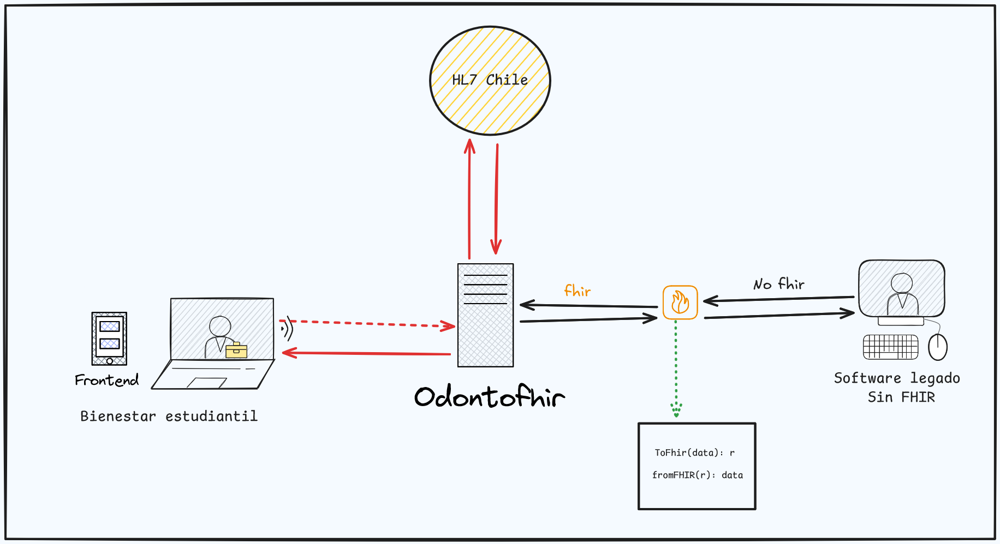

# OdontoFHIR-PY

## Aspectos Generales
El proyecto plantea el desarrollo de un sistema de ficha odontológica interoperable basado en el estándar [HL7-FHIR1](https://hl7.org/fhir/), permitiendo la gestión de información clínica de pacientes de manera estructurada y compartible entre diferentes sistemas de salud.

A fin de recolectar evidencias del uso de la ficha odontológica interoperable, este trabajo comprende la realización de un experimento de interoperabilidad. 

El mismo se llevará a cabo entre OdontoFHIR y un sistema que no implementa el estándar HL7-FHIR, con el desarrollo de un middleware. También con un sistema basado en HL7-FHIR desarrollado por la organización [HL7 Chile](https://hl7chile.cl), para demostrar la viabilidad del intercambio de información clínica odontológica a nivel internacional. 
Asimismo, incluye la construcción de perfiles personalizados de FHIR adaptados a las necesidades específicas de la atención odontológica de Paraguay.

### Autores

| **Nombre**                     | **Contacto**                       |  **Afiliacion**             |
| ---------------------------| -------------------------------| -------------------------|
| Diego Rubén Gómez Morel    | diegoruben10.drgm@fpuna.edu.py | [Facultad Politecnica - UNA](https://www.pol.una.py/) |
| José María Cabrera Peralta |  jaguarete2000@fpuna.edu.py    | [Facultad Politecnica - UNA](https://www.pol.una.py/) | 

#### Scope

La guia de Implementacion de OdontFHIR define 8 [Perfiles]:
- Expediente Odontologico `Bundle` 
- Ficha Clinica `Composition`
- Consulta Odontologica `Encounter`
- Hallazgos Odontologicos `Observation`
- Procedimiento Odontologico `Procedure`
- Paciente Odontologico `Patient`
- Profesional Odontologico `Practitioner`
- AllergyIntolerance `AllergyIntolerance`

La guia de Implementacion de OdontFHIR define 7 categorias para su terminologias:

- Anatomia Dental
- Hallazgos Odontologicos
- Procedimientos Odontologicos 
- Secciones Ficha Clinica
- Pueblos Indigenas 
- Direcciones de Paraguay
- Documento de Identidad

La guia de Implementacion de OdontFHIR contiene 1 caso de forma de uso para representar el intercambio de Fichas Odontologicas
- [**Escenario 1:**](background.md#escenario-1) Todavia nose titulo, creame un titulo para el siguiente escenario. Un niño va a su odontologo
y cuando es adolecente cambia a otro, ese recibe sus Expendiente Odontologico desde su antiguo consultorio quex 

##### Audiencia
La audiencia a quien va dirigida esta implementacion es a estudiantes que quieran aprender mas sobre el mundo de FHIR, a aquellos desarrolladores que realicen sistemas clinicos odontologicos dentro de la region de paraguay. Buscamos que este proyecto sea open source, por eso dejamos el link de nuestro github.
A quien beneficia OdontoFHIR? Pacientes, tendran la disponibilidad de su informacion en todo centro odontologico. Odontologos seugimiento de lpaciente y datos actualziados y presentes en momentos de urgencia. Desarrolladores la guia de implmetnacion para futuros desarrollos basados en odontoFHIR, interoperables con el mismo

###### Reconocimientos
Esta guia fue desarrollada y producida en base al trabajo de fin de grado.
Esta guia no podria ser posible sin el apoyo y confianza de PhD Sosa Cabrera como el que nos introdujo, animo y nos siguio paso a paso en este proyecto apoyando de forma academica como emocionalmente, nos entrego su confianza, Romina Rojas como nuestra tutora dentro de la carrera, aquella que nos corrigio y guio en nuestro documento, nos hizo esforzarnos a mejorar cada dia y pulio nuestra forma de expresarnos, Cesar Viaux Director de HL7 Chile que nostros siendo estudiantes desconocidos nos teniendo las manos para realizar este proyecto y nos guio en el recorrido. 

